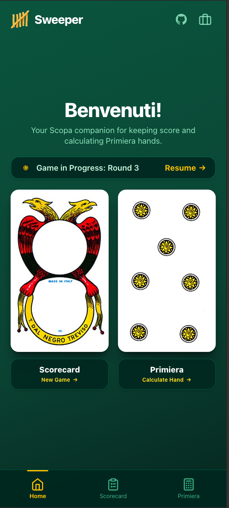
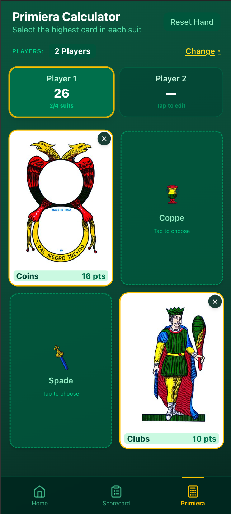
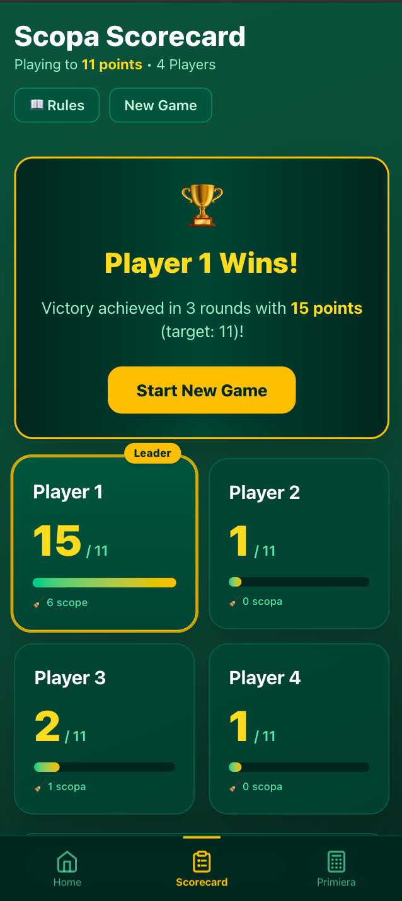

# Sweeper

**Scopa Italian card game score calculator & digital companion**

_by [Kim Robinson](https://github.com/kimmykokonut)_

| Home                            | Calculator                            | Scorecard                                             |
| ------------------------------- | ------------------------------------- | ----------------------------------------------------- |
|  |  |  |

See app [live](https://kimmykokonut.github.io/sweeper/)
_In Browser, choose `Add to Home Screen` to have a mobile experience_

---

📝 No more hunting for scrap paper and a pen to keep score while playing Scopa!

🤯 Discover your Primiera total without a headache.

🧮 Let the smart count assistant balance your cards and coins automatically.

🌞 Save your mental energy for that Settebello swipe.

## Jump around

- [Introduction](#introduction)
- [Features](#features)
- [Toolbelt](#toolbelt)
- [Known Bugs](#known-bugs)
- [Getting Started](#getting-started)
  - [Prerequisites](#prerequisites)
  - [Setup](#setup)
  - [Progressive Web App (PWA)](#optional-pwa)
- [Phases & Stretch Goals](#phases--stretch-goals)
- [Contact and Support](#contact-and-support)
- [License](#license)
- [Acknowledgements](#acknowledgements)

---

## Introduction

This project was originally inspired when teaching friends and family how to play Scopa, specifically the inevitable, collective headache when trying to figure out Primiera scoring at the end of a round.

I **greenfielded the initial project from scratch**—writing the core Primiera calculator logic, card data models, Neapolitan suit point rankings, and table layout by hand to sharpen my TypeScript and React skills. I also set up Vite's Progressive Web App (PWA) plugin on my own so I could have an installable, app-like experience on my phone without needing to manage native code or maintain a mobile app store presence. (And less maintenance on my end!)

Once that foundation was humming, I decided to use the project as an opportunity to dive into **AI-assisted development with Google's Antigravity (AGY)** to ramp up velocity and explore modern agentic workflows. Pairing with AGY as an AI pair-programmer, I directed and reviewed the expansion of Sweeper into a complete Scopa scorekeeping companion: tackling complex multi-player two-way auto-fill math, persistent game state, and dynamic mobile viewports. Every chunk was reviewed, tested, and manually committed, combining handcrafted domain logic with prompt-driven engineering to build a polished, full-featured digital scorepad!

## Features

Here is what Sweeper brings to your game table:

### 🏆 Full Scopa Scorecard (2–4 Players)

- Set up matches for 2, 3, or 4 players with custom player names and target scores (11 pts or custom).
- Score rounds with live point previews across all 5 official Scopa scoring categories:
  - **Scope (Sweeps)**: Quick-increment counter buttons for every sweep during play.
  - **Carte (Cards)**: Awarded to the player with the most captured cards.
  - **Denari (Coins)**: Awarded to the player with the most coins.
  - **Settebello (7 of Coins)**: Dedicated toggle for capturing the most valuable card in the deck.
  - **Primiera**: Select the round's Primiera winner manually or use the built-in calculator.
- Real-time score summaries, round-by-round point breakdown, and a victory banner when a player crosses the target score!

### ⚡ Smart Count Verification Assistant

- When tallying cards and coins at the end of a round, pop open the Count Helper:
  - **Instant Two-Way Auto-Fill**: In a 2-player game, entering 23 cards for Player 1 immediately auto-balances Player 2 to 17 cards (out of 40 total). Change your mind and type 25 into Player 2? Player 1 updates to 15 instantly!
  - **3+ Player Remainder Balancing**: Enter counts for all players except the last one, and the remainder auto-fills automatically.
  - **Clean Backspace Deletion**: Backspacing any score clears it cleanly without weird auto-fill snapbacks.
  - **Deck Limit Safeguards**: Input is strictly capped at 40 total cards and 10 total coins so math errors never ruin game night.
  - **Auto-Winner Detection**: Automatically identifies and highlights the Carte and Denari winners (or ties) based on your counts.

### 🃏 Authentic Primiera Calculator (Standalone & Embedded)

- Available as a standalone tool in the bottom navigation or embedded right inside the round scoring modal.
- Authentic Neapolitan card imagery for all four suits (_Denari / Coins_, _Spade / Swords_, _Coppe / Cups_, _Bastoni / Clubs_).
- Accurate Scopa Primiera point values ($7=21, 6=18, \text{Ace}=16, 5=15, 4=14, 3=13, 2=12, \text{Face}=10$).
- Live point calculations for each player and automatic tie/winner determination.

### 🔒 Physical Deck Uniqueness (No Duplicate Cards!)

- In real Scopa, there is only one 7 of Coins in the entire deck!
- When Player 1 claims a card in the Primiera picker, that card is automatically locked out for Player 2, 3, and 4 with a clear `🔒 Taken by Player 1` badge.
- Player 1 can still swap or deselect their card, which instantly frees it up for everyone else.

### 🚀 Direct Hand Transfer

- Ran a standalone Primiera calculation before starting your match?
- Once all hands are calculated, click **"Transfer to Scorecard"** to automatically initialize a fresh match and launch the Round 1 scorecard with the Primiera winner already pre-selected!

### 📱 Mobile-First Emerald Felt Table Design

- Styled with an immersive emerald-green card table aesthetic (`emerald-800`, `emerald-900`, `yellow-300`, `yellow-400`).
- **Dynamic Flexbox Viewports (`dvh`)**: Designed to stretch and breathe dynamically across compact 320px screens and ultra-tall 20:9 mobile displays without dead space or static pixel cutoffs.
- **Thumb-Friendly Bottom Navigation**: Easily hop between Home, Scorecard, and Primiera with a persistent bottom tab bar.
- **Safe-Area Aware**: Accounts for mobile home indicators and browser address bars so action buttons are never trapped or covered.

### 💾 Match Persistence & Game Resume

- Never lose your game if you accidentally refresh or close your browser!
- Active matches are automatically persisted to `localStorage`.
- The home screen greets you with a handy "Scoring in Progress" resume card so you can jump right back into the action.

### 📲 Progressive Web App (PWA)

- Install Sweeper directly to your phone's home screen via Safari or Chrome.
- Works offline, loads instantly, and runs full-screen without URL bars or browser chrome.

## Toolbelt


## Known Bugs

None at this time

## Getting Started

### Prerequisites

1. Code Editor

   To view or edit the code, you will need a code editor or text editor. The open-source code editor I used is Visual Studio Code.
   - Download: [Visual Studio Code](https://code.visualstudio.com/)
   - Select the download most applicable to your OS and system.
   - Download & install -- Windows will run the setup exe and macOS will drag and drop into Applications.

2. Node (& Homebrew)

```bash
node -v
```

_If you don't have node_, you can easily install via homebrew

```bash
brew install node
```

_If you don't have homebrew_, install instructions [here](https://brew.sh/)

### Setup

1. Navigate to the [repository](https://github.com/kimmykokonut/sweeper).

2. Select the `Fork` button and you will be taken to a new page where you can give your repository a new name and description. Choose "create fork".

3. Select the `Code` button and copy the url for HTTPS.

4. On your local computer, create a working directory of your choice.

5. Clone repo:

```bash
git clone https://github.com/kimmykokonut/sweeper
```

6. Navigate into the project directory:

```bash
cd sweeper
```

7. View/Edit in VS Code:

```bash
code .
```

8. Install dependencies:

```bash
npm install
```

9. Run local server for development:

```bash
npm run dev
```

Open [http://localhost:5173/](http://localhost:5173/) with your browser to see the local app.

### Optional (PWA)

Vite's Progressive Web App plugin is configured out of the box.

Build:

```bash
npm run build
```

Test production build locally:

```bash
npm run preview
```

➜ [Localhost url](http://localhost:4173/)

## Phases & Stretch Goals

### Phases

- [x] **Phase 1**: Build Primiera calculator for 1 person
- [x] **Phase 2**: Primiera calc for up to 4 players, assess winner and display
- [x] **Phase 3**: Add Scopa scorecard for up to 4 players with smart round scoring
- [x] **Phase 4**: Progressive Web App plugin with offline support
- [x] **Phase 5**: Game data persistence (`localStorage`) & active game resume flow

### Stretch

- [ ] Stats - track game data for user via device.
- [ ] Cribbage integration?
- [ ] Custom sound effects or haptic feedback for sweeps (Scope!)

## Contact and Support

If you have any feedback or concerns:

- [Report Bug](https://github.com/kimmykokonut/sweeper/issues)
- [Request Feature](https://github.com/kimmykokonut/sweeper/issues)

## License

[GNU GENERAL PUBLIC LICENSE](/LICENSE)

## Acknowledgements

Card images attributed to [Wikimedia Commons (Naples deck)](https://commons.wikimedia.org/wiki/Category:Naples_deck)
