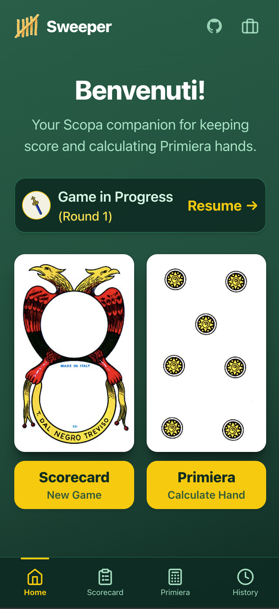
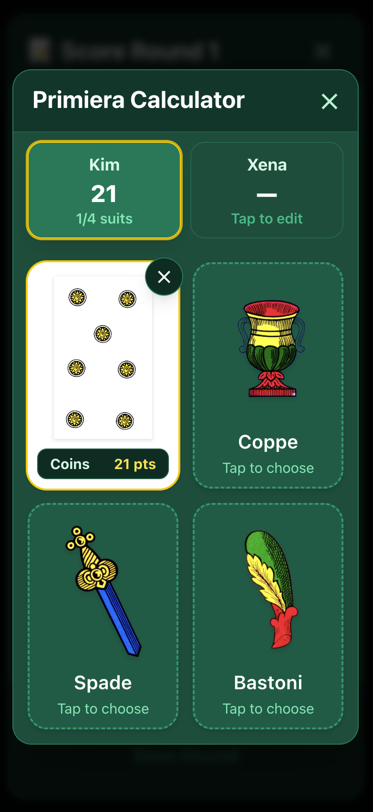
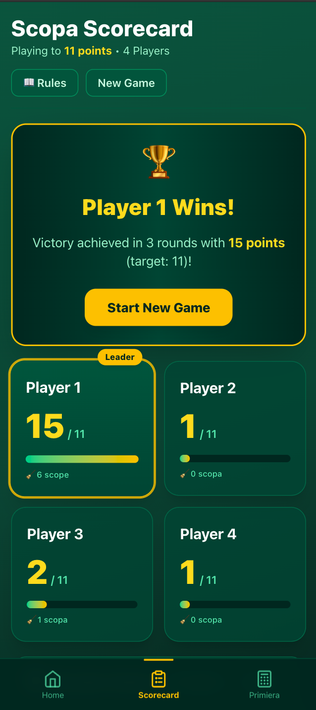
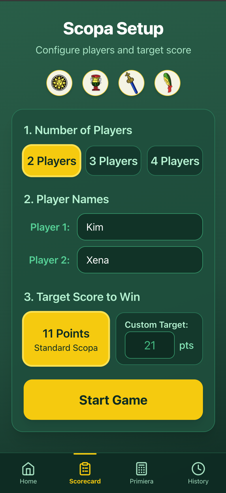
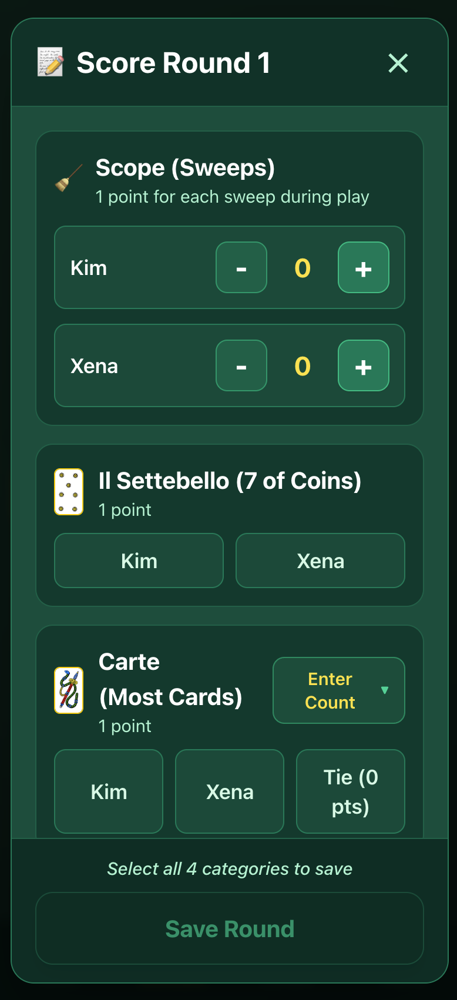
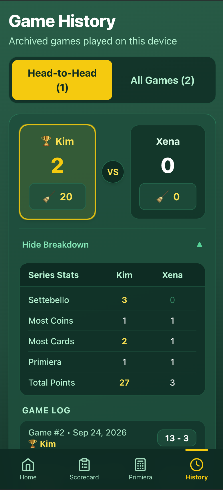

# Sweeper

**Scopa Italian card game score calculator & digital companion**

_by [Kim Robinson](https://github.com/kimmykokonut)_

| Home                            | Calculator                            | Scorecard                                                 |
| ------------------------------- | ------------------------------------- | --------------------------------------------------------- |
|  |  |  |

| Setup                                                       | Scoring Action                                   | Stats                                             |
| ----------------------------------------------------------- | ------------------------------------------------ | ------------------------------------------------- |
|  |  |  |

See app [live](https://kimmykokonut.github.io/sweeper/)
_In Browser, choose `Add to Home Screen` for the best mobile experience._

---

📝 No more hunting for scrap paper and a pen to keep score while playing Scopa!

🤯 Discover your Primiera total without a headache.

🧮 Let the smart count assistant balance your cards and coins automatically.

🌞 Save your mental energy for that Settebello swipe.

## Jump around

- [Introduction](#introduction)
- [Features](#features)
- [Toolbelt](#toolbelt)
- [Known Bugs](#known-bugs)
- [Getting Started](#getting-started)
  - [Prerequisites](#prerequisites)
  - [Setup](#setup)
  - [Progressive Web App (PWA)](#optional-pwa)
- [Phases & Stretch Goals](#phases--stretch-goals)
- [Contact and Support](#contact-and-support)
- [License](#license)
- [Acknowledgements](#acknowledgements)

---

## Introduction

This project was originally inspired when teaching friends and family how to play Scopa, specifically the inevitable, collective headache when trying to figure out Primiera scoring at the end of a round.

I **greenfielded the initial project from scratch**—writing the core Primiera calculator logic, card data models, Neapolitan suit point rankings, and table layout by hand to sharpen my TypeScript and React skills. I also set up Vite's Progressive Web App (PWA) plugin on my own so I could have an installable, app-like experience on my phone without needing to manage native code or maintain a mobile app store presence. (And less maintenance on my end!)

Once that foundation was humming, I decided to use the project as an opportunity to dive into **AI-assisted development with Google's Antigravity (AGY)** to ramp up velocity and explore modern agentic workflows. Pairing with AGY as an AI pair-programmer, I directed and reviewed the expansion of Sweeper into a complete Scopa scorekeeping companion: tackling complex multi-player two-way auto-fill math, persistent game state, and dynamic mobile viewports. Every chunk was reviewed, tested, and manually committed, combining handcrafted domain logic with prompt-driven engineering to build a polished, full-featured digital scorepad!

## Features

Here is what Sweeper brings to your game table:

### 🏆 Full Scopa Scorecard (2–4 Players)

- Set up matches for 2, 3, or 4 players (individuals or 2-teams-of-2) with custom names and target scores (11 pts or custom).
- Score rounds with live point previews across all 5 official categories: **Scope (Sweeps)**, **Carte (Cards)**, **Denari (Coins)**, **Settebello (7 of Coins)**, and **Primiera**.
- Live leaderboard, progress bars, collapsible round breakdown, and instant victory banners.

### ⚡ Smart Count Verification Assistant

- **Two-Way Auto-Fill**: In 2-player games, entering 23 cards for Player 1 immediately auto-balances Player 2 to 17 (out of 40 total), and vice versa.
- **Remainder Balancing**: For 3+ players, enter counts for all players except the last and the remainder auto-fills instantly.
- **Deck Safeguards**: Clean backspace deletion without snapbacks, strictly capped at 40 total cards and 10 total coins with auto-winner detection.

### 🃏 Authentic Primiera Calculator (Standalone & Embedded)

- Available as a standalone tab in bottom navigation or embedded right inside the round scoring dialog.
- Authentic Neapolitan deck imagery across all four suits (_Denari_, _Spade_, _Coppe_, _Bastoni_) with accurate Scopa Primiera point values ($7=21, 6=18, \dots$, face cards $=10$).
- **Deck Uniqueness Locks**: Claimed cards automatically lock for other players with a `🔒 Taken by Player` badge.
- **Direct Hand Transfer**: One-tap transfer from standalone calculator directly into a fresh Round 1 scorecard with the winner pre-selected.

### 📊 Game History & Head-to-Head Rivalry Records

- Archived game history saved directly in browser `localStorage`—no accounts or database servers needed.
- **Head-to-Head Rivalry View**: Tracks series records, win rates, total sweeps, and category dominance (Carte, Denari, Settebello, Primiera) between opponents.
- Complete round-by-round reviews with individual game deletion and clear-all controls.

### 💾 Backup, Export & Restore (Zero-Cloud Match Transfer)

- **JSON Backup Export**: Download your completed match history as a portable `.json` file (`sweeper-history-YYYY-MM-DD.json`) with one tap.
- **Cross-Device Restore & Merge**: Transfer your match history between phones, tablets, or browsers with intelligent duplicate detection—choose to **Merge** new games safely or **Replace** completely.
- **Defensive & Private**: 100% client-side validation against corrupted files with zero accounts, cloud tracking, or external server dependencies.

### 📱 Mobile-First Emerald Felt Table & WCAG Accessibility

- Immersive emerald-green card table theme with dynamic viewport sizing (`dvh`) tailored for small phones through ultra-tall screens.
- **WCAG Compliant**: Flexible 44px touch targets on all interactive controls, high-contrast gold focus rings, high contrast text (> 7:1 AAA), and full screen-reader semantics.
- Consistent modal controls: tap the background or press `Escape` to dismiss.

### 💾 Match Persistence & Crash Recovery

- Active games automatically persist to `localStorage` with defensive schema validation.
- Quick-resume banner on the home screen lets you jump straight back into your match.
- Styled fallback error screen with instant recovery options to return home or start a fresh match.

### 📲 100% Offline Progressive Web App (PWA)

- Install Sweeper directly to your phone's home screen via Safari or Chrome.
- Complete offline precaching: all 40 Italian cards and assets load instantly without internet.

## Toolbelt


## Known Bugs

None at this time

## Getting Started

### Prerequisites

1. Code Editor

   To view or edit the code, you will need a code editor or text editor. The open-source code editor I used is Visual Studio Code.
   - Download: [Visual Studio Code](https://code.visualstudio.com/)
   - Select the download most applicable to your OS and system.
   - Download & install -- Windows will run the setup exe and macOS will drag and drop into Applications.

2. Node (& Homebrew)

```bash
node -v
```

_If you don't have node_, you can easily install via homebrew

```bash
brew install node
```

_If you don't have homebrew_, install instructions [here](https://brew.sh/)

### Setup

1. Navigate to the [repository](https://github.com/kimmykokonut/sweeper).

2. Select the `Fork` button and you will be taken to a new page where you can give your repository a new name and description. Choose "create fork".

3. Select the `Code` button and copy the url for HTTPS.

4. On your local computer, create a working directory of your choice.

5. Clone repo:

```bash
git clone https://github.com/kimmykokonut/sweeper
```

6. Navigate into the project directory:

```bash
cd sweeper
```

7. View/Edit in VS Code:

```bash
code .
```

8. Install dependencies:

```bash
npm install
```

9. Run local server for development:

```bash
npm run dev
```

Open [http://localhost:5173/](http://localhost:5173/) with your browser to see the local app.

10. Run test suite:

```bash
npm run test
```

### Optional (PWA)

Vite's Progressive Web App plugin is configured out of the box with offline card precaching.

Build:

```bash
npm run build
```

Test production build locally:

```bash
npm run preview
```

➜ [Localhost url](http://localhost:4173/)

## Phases & Stretch Goals

### Phases

- [x] **Phase 1**: Greenfield Primiera calculator for 1 person
- [x] **Phase 2**: Primiera calculator for up to 4 players with deck uniqueness locks & winner detection
- [x] **Phase 3**: Full Scopa scorecard (2–4 players, teams, smart count assistant, round history)
- [x] **Phase 4**: Progressive Web App (PWA) with full offline Italian card precaching
- [x] **Phase 5**: Game data persistence (`localStorage`) & active game resume flow
- [x] **Phase 6**: Game history archive, head-to-head rivalry records & category dominance
- [x] **Phase 7**: Comprehensive WCAG accessibility, 60 automated unit tests & CI pipeline
- [x] **Phase 8**: Match history backup, JSON export & cross-device restore with duplicate detection

### Stretch

- [ ] Regional Italian deck art selection (Piacentine, Siciliane, Trevigiane)
- [ ] Cribbage companion integration
- [ ] Custom sound effects or haptic feedback for sweeps (Scope!) Animation?
- [ ] Multi-device live game sync

## Contact and Support

If you have any feedback or concerns:

- [Report Bug](https://github.com/kimmykokonut/sweeper/issues)
- [Request Feature](https://github.com/kimmykokonut/sweeper/issues)

## License

[GNU GENERAL PUBLIC LICENSE](/LICENSE)

## Acknowledgements

Card images attributed to [Wikimedia Commons (Naples deck)](https://commons.wikimedia.org/wiki/Category:Naples_deck)
